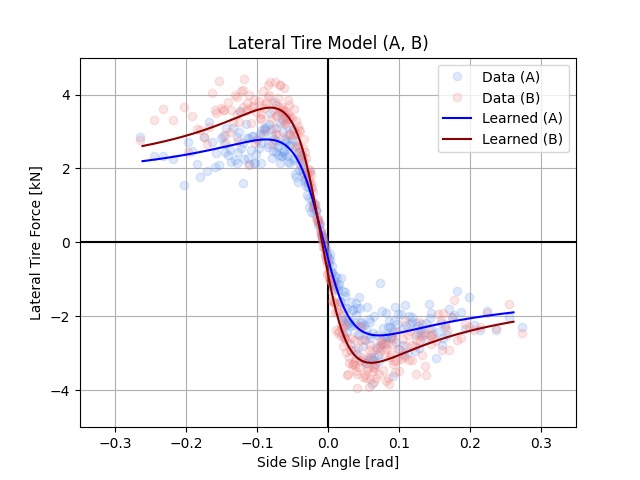

# Data-Driven Model Identification via Hyperparameter Optimization for the Autonomous Racing System

## Abstract
In this letter, we propose a model identification method via hyperparameter optimization (MIHO). Our method is able to identify the parameters of the parametric models in a data-driven manner. We utilize MIHO for the dynamics parameters of the AV-21, the full-scaled autonomous race vehicle, and integrate them into our model-based control system. In experiments, the models with the optimized parameters demonstrate the generalization ability of the vehicle dynamics model. We further conduct extensive field tests to validate our system. The tests show that our race system leverages the learned model dynamics well and successfully performs obstacle avoidance and high-speed driving over $200 km/h$ at the Indianapolis Motor Speedway and Las Vegas Motor Speedway.

## Comments
- Preprint paper will be available soon.
- Submitted to [IEEE Control System Letters (L-CSS)](http://ieee-cssletters.dei.unipd.it/)

## Video demonstration
- Field tests at the Indianapolis Motor Speedway (IMS) and Las Vegas Motor Speedway (LVMS)
[](https://youtu.be/xxxxx)

## Usage
```bash
# Run model identification
python3 run_model_identification.py

# Plot the learned model with data
python3 plot_learned_model.py
```

## Results of Model Identification (Example dataset)
Since the dataset of AV-21 is confidential, we made a reasonable example dataset to run our codes.
<p align="center">
    
</p>

## References
We refer the following for Hyperband:
- Hyperband paper: <https://arxiv.org/abs/1603.06560>
- Implementation based on [hyperband](https://github.com/bkj/hyperband)

## Disclaimer

For any question, please contact [Hyunki Seong](https://github.com/hynkis).
